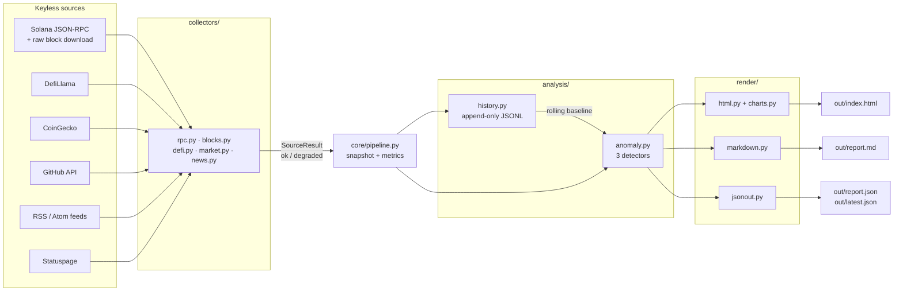

# Solana Pulse

**An auto-updating report on the state of the Solana ecosystem — one Python file to run, no API keys, no dependencies beyond the standard library.**

Live dashboard: **https://tradingstation111.github.io/solana-pulse/**
Sample outputs: [`samples/report.md`](samples/report.md) · [`samples/report.json`](samples/report.json) · [`samples/latest.json`](samples/latest.json)

---

## Run it in three commands

```bash
git clone https://github.com/tradingstation111/solana-pulse.git
cd solana-pulse
python3 solana_pulse.py
```

That's the whole setup. There is no `pip install`, no `requirements.txt`, no `.env`, no key to register for. Python 3.10 or newer is the only prerequisite. A run takes about 15 seconds and writes:

| File | What it is |
|---|---|
| `out/index.html` | Interactive dark-theme dashboard, a single self-contained file (inline CSS, JS and SVG — it works offline from `file://`) |
| `out/report.md` | Human-readable Markdown report |
| `out/report.json` | Full machine-readable snapshot: every metric, every section, every alert, every source |
| `out/latest.json` | Small, stable summary for polling by a bot, badge or uptime check |
| `data/history.jsonl` | Append-only metric history — one line per run. This is what the anomaly detector compares against |

Useful flags:

```bash
python3 solana_pulse.py --interval 30m       # run forever, regenerating every 30 minutes
python3 solana_pulse.py --out docs           # write somewhere else
python3 solana_pulse.py --blocks 12          # sample more blocks (more detail, more bandwidth)
python3 solana_pulse.py --no-blocks --quiet  # fastest, lowest-bandwidth run
python3 -m unittest discover -s tests -t .   # 75 offline tests, no network needed
```

Docker, if you prefer: `docker build -t solana-pulse . && docker run solana-pulse`.

---

## Architecture



Plain text, for anyone whose viewer does not render Mermaid:

```
sources ──► collectors/ ──► core/pipeline.py ──► analysis/history.py (data/history.jsonl)
                                    │                      │
                                    │                      ▼
                                    └────────────► analysis/anomaly.py ──► alerts
                                    │
                                    └────────────► render/ ──► index.html · report.md · report.json
```

```
solana_pulse.py          CLI entry point
core/net.py              HTTP + JSON-RPC with retry, backoff, size ceiling, fault isolation
core/config.py           endpoints, thresholds, sampling sizes, watched accounts
core/pipeline.py         runs all collectors, builds the snapshot, derives cross-source metrics
collectors/rpc.py        cluster, performance, vote accounts, gossip nodes, supply, accounts
collectors/blocks.py     downloads raw blocks and derives fees, failures, wallet counts
collectors/market.py     CoinGecko
collectors/defi.py       DefiLlama: TVL, protocols, DEX volume, fees/REV, stablecoins, RWA
collectors/news.py       RSS/Atom, SIMD pull requests, client releases, status page
analysis/history.py      append-only JSONL store
analysis/anomaly.py      three detectors (see below)
render/                  html.py, charts.py, theme.py, markdown.py, jsonout.py, fmt.py
tests/                   75 unit tests, all offline, real recorded fixtures
```

**Fault isolation is the design centre.** Every source is fetched through one wrapper (`core.net.guarded`) that converts any exception — network, HTTP, or parse — into a failed `SourceResult`. A dead upstream degrades exactly one dashboard section, which then renders a visible *"source unavailable"* banner carrying the exact error. The run never crashes and never silently omits something. Section 07 of the dashboard shows every source, its latency, and its error if it has one.

---

## Data sources and how they are integrated

Every source below is public and requires no key, no account and no token.

| Source | Data taken | Integration notes |
|---|---|---|
| **Solana JSON-RPC** — `api.mainnet-beta.solana.com`, failover to `solana-rpc.publicnode.com` | `getHealth`, `getVersion`, `getEpochInfo`, `getBlockTime`, `getBlockHeight`, `getRecentPerformanceSamples`, `getVoteAccounts`, `getClusterNodes`, `getSupply`, `getInflationRate`, `getBalance`, `getSignaturesForAddress`, `getSlot`, `getBlock` | Calls run sequentially on one client so a run costs one provider's rate budget; the endpoint that answered is remembered and tried first. `rpc.ankr.com`, `drpc.org`, Helius and Omnia were tested and all refuse anonymous requests, so they are not in the list. |
| **Raw Solana blocks** (same RPC) | 6 finalised blocks per run, downloaded in full with account details and parsed locally | Produces the numbers no aggregator gives away for free: median and p90 transaction fee, priority-fee share, on-chain failure rate, vote/user transaction mix, unique fee payers. See *Direct block sampling* below. |
| **DefiLlama** `api.llama.fi` | Chain TVL and its full daily history, per-protocol TVL on Solana, category mix, DEX volume, chain fees and REV, tokenised RWA including equities | Centralised-exchange wallets and bridges are excluded from the DeFi TVL figures — they hold assets *on* Solana without being Solana DeFi, and counting them inflates the number by roughly two-thirds. |
| **DefiLlama stablecoins** `stablecoins.llama.fi` | Per-asset circulating supply on Solana, 24h/7d change, peg price, 12-month float history | Filtered to the `Solana` entry of each asset's `chainCirculating` map. |
| **CoinGecko** `api.coingecko.com` | SOL price, market cap, FDV, volume, 1h/24h/7d/30d changes, ATH, 90-day daily chart, top `solana-ecosystem` tokens | The anonymous tier throttles hard, so the run makes exactly three calls, sequentially, with exponential backoff on HTTP 429. |
| **GitHub REST API** (anonymous, 60 req/h) | Open and recently merged SIMDs from `solana-foundation/solana-improvement-documents`; Agave and Firedancer releases | SIMD numbers are extracted from PR titles; proposals matching tracked keywords (Alpenglow, SIMD-525 and others, configurable) are pulled into a highlighted panel. |
| **RSS / Atom feeds** | solana.com news, Helius blog, Agave and Firedancer release feeds, SIMD repository commits | Parsed with `xml.etree` from the standard library; one parser handles both RSS 2.0 and Atom 1.0. A failing feed is listed by name rather than hidden. |
| **Solana Statuspage** `status.solana.com` | Overall indicator, per-component status, open incidents | Any non-operational component raises an alert. |

### Deliberately not included

**X / Twitter sentiment.** There is no keyless, terms-compliant way to read X. The public mirrors that exist are unreliable enough that any number taken from them would be a guess presented as data. The dashboard says so in plain words and links the official accounts instead. Fabricating a sentiment score would have been easy and would have been worse than the gap. If a key ever becomes acceptable, it is one new file in `collectors/`.

**Dune Analytics.** Dune's API requires a key. Everything Solana Pulse would have taken from Dune — DEX volume, fees, REV, active wallets — is obtained keylessly instead, and the wallet figures are measured directly on chain rather than read from someone's dashboard.

---

## Automation strategy

`.github/workflows/pulse.yml` runs the whole thing on GitHub's infrastructure:

1. **Schedule** — `cron: "*/30 * * * *"`, every 30 minutes. Changing the cadence means editing that one line. `workflow_dispatch` allows a manual run with a chosen block-sample size.
2. **No install step.** The workflow checks out the code, sets up Python and runs. There is nothing to install, which is also why there is nothing to break when a transitive dependency is yanked.
3. **Tests first.** The 75 unit tests run before every collection. A broken parser fails the workflow instead of publishing a wrong number.
4. **History is committed.** Each run appends roughly 700 bytes to `data/history.jsonl` and commits it. That file *is* the anomaly baseline, so persisting it across runs is what makes detection work at all. The full outputs are published to Pages rather than committed, which keeps the repository small; `samples/` is refreshed on manual runs so the repository always carries a readable example.
5. **Concurrency guard.** A `concurrency` group prevents two collections from racing on the history file, and the push retries with `--rebase` if a peer run landed first.
6. **Deploy.** `out/` is uploaded as a Pages artifact and deployed, so the live dashboard is never more than about 30 minutes old.

Running it yourself, without GitHub: `python3 solana_pulse.py --interval 30m` does the same loop locally and survives a failed run rather than exiting. The Dockerfile wraps that for a server.

---

## Anomaly detection

Three independent detectors run on every report. All three write into the same `alerts` array, which appears in the HTML, the Markdown and the JSON.

### 1. Statistical — robust outliers against the report's own history

For each watched metric, the **modified z-score** is computed over the last 96 runs:

```
z = 0.6745 × (x − median) / MAD          MAD = median(|x − median|)
```

Median and median absolute deviation are used instead of mean and standard deviation on purpose: with mean/σ, one earlier spike inflates the baseline and **hides the next one**. There is a test for exactly that (`test_single_earlier_spike_does_not_mask_the_next`). `|z| ≥ 3.5` raises a warning, `|z| ≥ 5.0` is critical — the Iglewicz–Hoaglin cut.

Two refinements that keep the panel worth reading:

* **Direction awareness.** A *rising* Nakamoto coefficient is good news and never alerts. Slot time, delinquency and dominant-client share only alert upward; validator count and gossip nodes only downward.
* **A relative-change floor.** A metric with a very small MAD can produce a large z from a trivial move. Each metric declares the minimum relative change worth reporting, so the detector does not cry wolf over a 0.4% wobble.

Nothing statistical fires until 5 runs of history exist; until then the dashboard says *"baseline building"* rather than showing false positives.

Watched metrics: TPS, non-vote TPS, slot time, delinquent stake and count, validator count, Nakamoto coefficient, top-10 stake concentration, TVL, SOL price, DEX volume, chain fees, stablecoin float, median transaction fee, transaction failure rate, gossip node count, dominant client share.

### 2. Threshold rules — conditions that are bad regardless of history

Statistics cannot flag a state that has simply always been true: a permanently unhealthy cluster has a perfectly stable baseline. Fixed rules cover those.

| Rule | Threshold | Severity |
|---|---|---|
| RPC `getHealth` not `ok` | any | critical |
| Slot time | > 600 ms / > 800 ms | warning / critical |
| Delinquent stake | > 2% / > 5% | warning / critical |
| Throughput collapse | < 500 TPS | critical |
| Nakamoto coefficient | < 15 | warning |
| Dominant validator client | > 85% of nodes | warning |
| User transaction failure rate | > 65% | warning |
| Statuspage component not operational | any | warning |
| Dollar stablecoin below peg | < $0.98 and ≥ $25M on Solana | warning |

Two of those thresholds are deliberately not where a naive implementation would put them, and the reasoning is worth stating:

* **Failure rate at 65%, not 40%.** Solana's user-transaction failure rate normally sits between 30% and 50% because arbitrage bots submit transactions that are *expected* to fail. A 40% threshold would fire on every single run and train the reader to ignore the panel.
* **Stablecoin depeg is downside-only.** Several dollar-pegged tokens on Solana accrue yield and are *designed* to trade above $1 (USDY, sUSD). An `abs(price − 1) > 0.02` rule flags them permanently. Breaking the buck is the condition that carries risk, so only downside deviation alerts, and only for assets large enough for the quote to mean something.

### 3. Cross-source correlation — signals a single-source dashboard cannot see

These exist only because the report holds several sources at once.

* **TVL / price divergence.** SOL moves more than 5% in 24h while TVL moves in the other direction, or barely moves, by more than 8 points. Capital holding still while the token runs means the move is traders, not users.
* **Fee-to-volume ratio shift.** Chain fees as basis points of DEX volume, scored against its own baseline. A rise points at congestion pricing; a fall points at volume arriving through cheaper paths.
* **Congestion signature.** Throughput *and* on-chain failure rate both elevated together — demand the cluster is not fully absorbing. Either one alone is unremarkable; together they mean something.
* **Stablecoin share of TVL.** A rising share is dry powder on the sidelines; a falling share is capital rotating into risk.

---

## Direct block sampling

Most Solana dashboards report fees and activity by reading an aggregator. Solana Pulse downloads six finalised blocks per run — about 6 MB each, with full account details — and computes them itself:

* **Median and p90 transaction fee**, separated into base fee (5,000 lamports per signature) and priority fee, over user transactions only.
* **On-chain failure rate**, over *user* transactions. Vote transactions almost never fail, so including them in the denominator understates the rate a wallet actually experiences. That correction is a unit test.
* **Vote / user transaction mix**, which is what the raw TPS headline hides.
* **Unique fee payers** per block and across the sample, plus a **capture-recapture estimate** of the active-wallet population in the sampling window, using Chapman's bias-corrected estimator over two disjoint halves of the sample:

  ```
  N̂ = (n₁+1)(n₂+1) / (m+1) − 1
  ```

  Stated honestly, on the dashboard and here: automated wallets appear in every block, which violates the equal-capture assumption and inflates the result. It is an order-of-magnitude reading for the sampling window, **not** a daily active-user count, and it is labelled that way everywhere it appears.

`--no-blocks` skips all of this if bandwidth matters more than detail.

---

## How to read each section of the dashboard

| Section | What it answers | What to look at first |
|---|---|---|
| **01 Alerts** | Is anything wrong right now? | Colour and detector tag. `robust-z` means "unusual for this chain"; `rule` means "bad in absolute terms"; `correlation` means "two sources disagree". |
| **02 Network** | Is the chain fast and healthy? | Slot time against the ~400 ms target, then epoch progress. The block-sampling card is the only place with a real median fee. |
| **03 Validators** | How decentralised and how healthy is consensus? | Nakamoto coefficient (higher is better), delinquent stake (consensus halts at 33%), and the client-diversity donut — a monoculture is a single point of failure. The directory is searchable and sortable entirely in-page. |
| **04 Economy** | What is the chain worth and what does it earn? | Price and TVL side by side; if they disagree, the alerts panel will already have said so. Chain fees are the REV line. |
| **05 Growth** | Is real-world value and real usage arriving? | Tokenised RWA and equities, then wallet activity measured on chain. |
| **06 Upgrades & News** | What is coming? | Highlighted SIMDs, then the client releases — Firedancer's cadence is the thing to watch. |
| **07 Sources** | Can I trust this run? | Any red row, with the exact error. Latency per source is shown too. |
| **08 Methodology** | How was it made? | Every formula and threshold, stated. |

Reading the JSON instead: `out/latest.json` is the small, stable contract (status, alert counts, ~18 headline metrics) meant for polling. `out/report.json` is the full snapshot and its shape may grow.

---

## Testing

```bash
python3 -m unittest discover -s tests -t . -v
```

75 tests, no network access, running against recorded fixtures — a real mainnet block, real SIMD pull-request payloads, real feed documents. They cover the block parser, the RSS/Atom parser, the SIMD parser, the Nakamoto computation, all three anomaly detectors, the history store (including a deliberately truncated line), all three renderers, and the chart primitives against degenerate input. The dashboard test asserts there are **no external resource references**, which is what keeps the single-file promise honest.

---

## Limitations, stated plainly

* Aggregated economic figures (TVL, DEX volume, fees, stablecoin float) carry DefiLlama's and CoinGecko's methodologies and their later revisions. They are labelled with their source everywhere.
* RPC readings are point-in-time and reflect whichever endpoint answered; `getRecentPerformanceSamples` is a 30-minute window, not an instantaneous figure.
* The active-wallet estimate is a window estimate with a known upward bias, described above. It is not a DAU figure and is never presented as one.
* Public RPC endpoints rate-limit anonymous callers. At the default 30-minute cadence this is comfortable; at a one-minute cadence it would not be.
* Statistical detection needs history. A freshly cloned repository starts with an empty baseline and says so until it has five runs.
* X/Twitter sentiment is absent, for the reason given above.

## Licence

MIT — see [`LICENSE`](LICENSE). Original work; no code was copied from any existing project.
